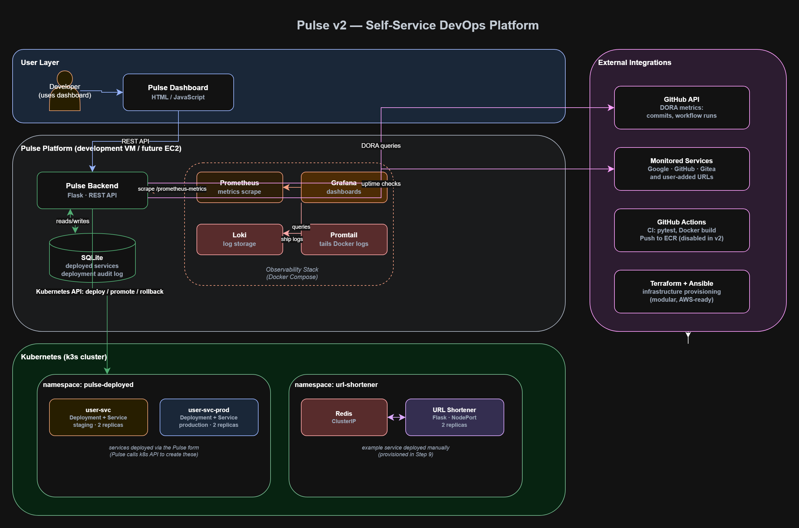
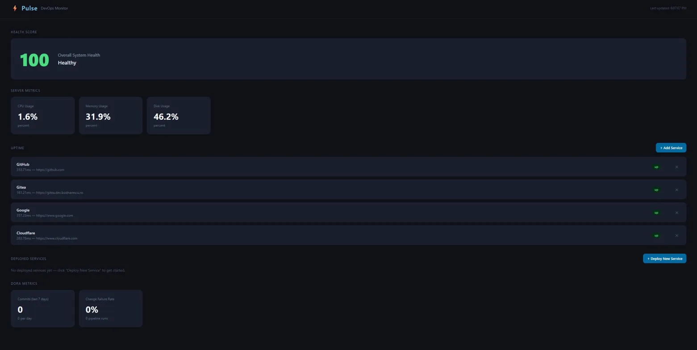
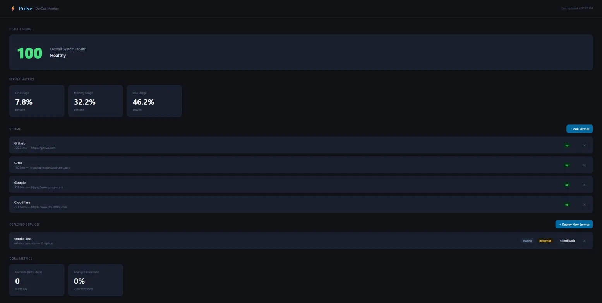
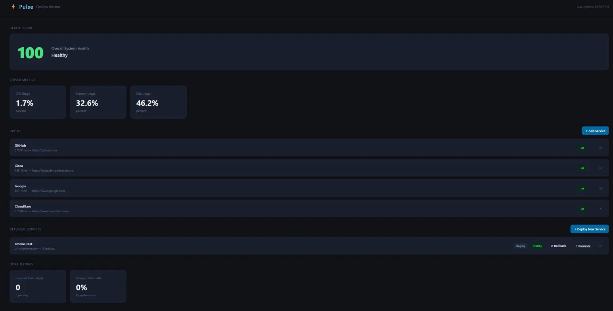
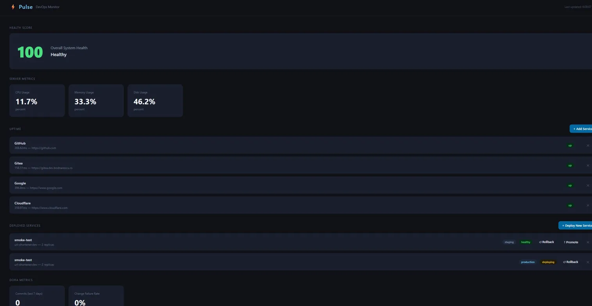
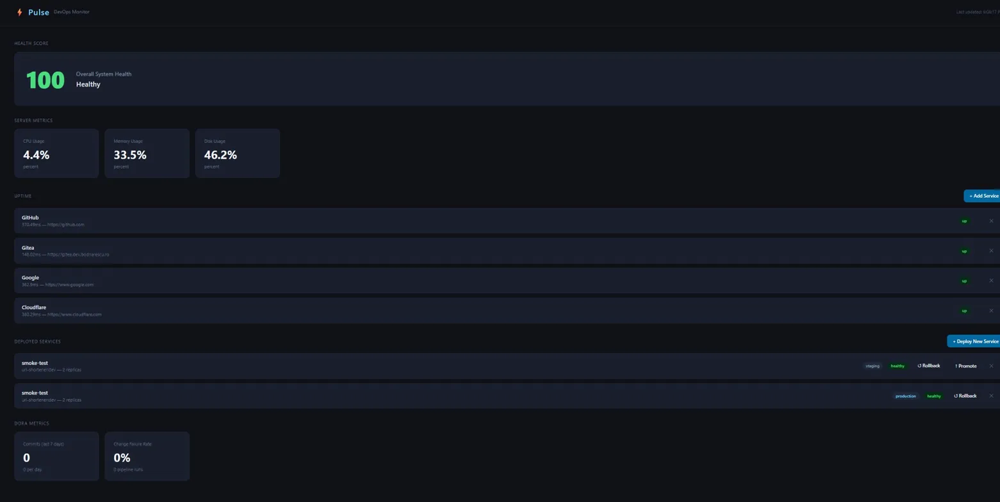
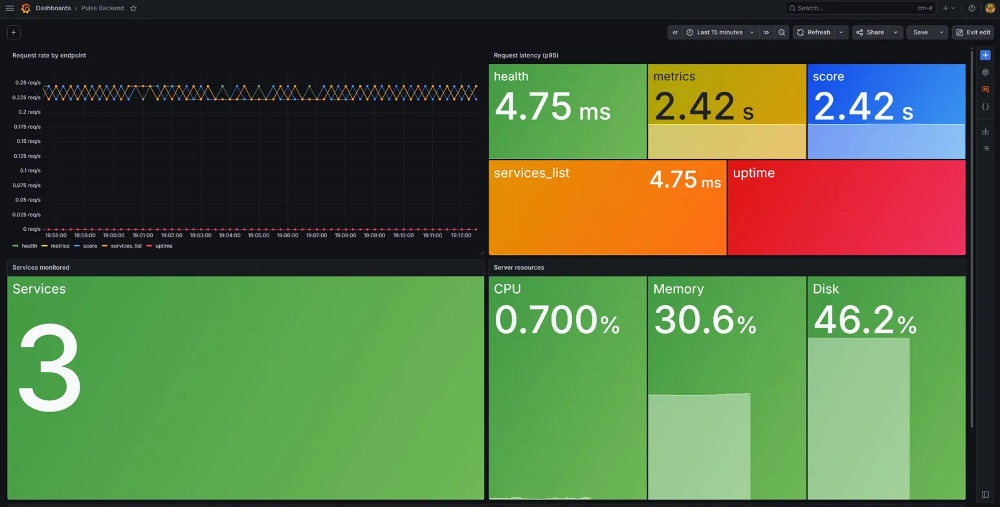
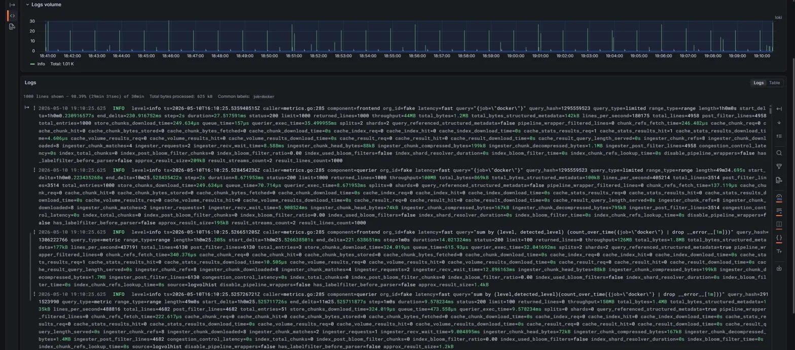
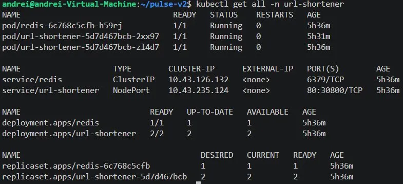

# Pulse v2

A self-service developer platform built around a real Kubernetes cluster.

Pulse lets a developer fill out a form on a dashboard and have a service deployed, promoted from staging to production, or rolled back to an earlier version — all backed by an audit trail and live observability. It's a small implementation of the kind of platform engineering work that real DevOps teams do for their internal customers.

This is the second version of [Pulse v1.5](https://github.com/Bragashh/pulse), a monitoring-only dashboard. v2 keeps the monitoring foundation and adds the self-service deploy / promote / rollback loop, full Prometheus + Grafana + Loki observability, and a real Kubernetes cluster as the deployment target.

## Architecture



Three logical layers:

- **User layer** — the developer interacts with a dashboard in the browser
- **Pulse platform** — the Flask backend, SQLite for state, and the observability stack (Prometheus, Grafana, Loki, Promtail) running together via Docker Compose
- **Kubernetes (k3s)** — services deployed by Pulse land in the `pulse-deployed` namespace; an example service (URL shortener with Redis) lives in its own namespace as a deployment target reference

External integrations on the right: GitHub API for DORA metrics, monitored services for uptime checks, GitHub Actions for CI, Terraform + Ansible for provisioning.

## Features

The dashboard provides:

- **Service uptime monitoring** — add or remove monitored URLs from the form; latency and status updated continuously
- **Server health metrics** — CPU, memory, disk, with a calculated overall health score
- **DORA metrics** — deployment frequency and change failure rate, sourced from the GitHub Actions API of the source repo
- **Self-service deploy** — fill in a service name, container image, port, replicas, and environment; click Deploy. Pulse calls the Kubernetes API and tracks the deployment from "deploying" to "healthy" in the database
- **Promote staging to production** — one-click promotion deploys the same image to a parallel production deployment in Kubernetes
- **Rollback** — view deployment history for a service, pick an older deployment, redeploy that image. The rollback itself is recorded as a new deployment so the audit trail stays append-only

The observability stack provides:

- **Prometheus metrics** — request rate, latency histogram, server resources, services count, all instrumented in the Flask app
- **Grafana dashboards** — visual view of metrics, with dropdowns and time-range controls
- **Loki + Promtail logs** — Docker container stdout collected and queryable via Grafana

## Tech stack

| Layer | Tools |
| --- | --- |
| Backend | Python 3.12, Flask, prometheus-client, kubernetes (Python client) |
| Frontend | Vanilla HTML / CSS / JavaScript |
| Data | SQLite |
| Observability | Prometheus, Grafana, Loki, Promtail |
| Container orchestration | k3s (lightweight Kubernetes) |
| Containers | Docker |
| Infrastructure as code | Terraform (modular), Ansible |
| CI/CD | GitHub Actions (pytest, Docker build) |
| Tests | pytest, pytest-flask, pytest-mock — 66 tests covering routes, DB, and deploy/promote/rollback |

## Screenshots

### The dashboard



### Self-service deploy in progress



A deployment goes from `deploying` to `healthy` automatically as Kubernetes brings the pods up. Pulse polls the Kubernetes API every 2 seconds.

### Healthy staging deployment with Promote button



### Promoting to production



### Both staging and production running



### Grafana metrics dashboard



Custom Pulse metrics include `pulse_http_requests_total` (counter, per-endpoint), `pulse_http_request_duration_seconds` (histogram, for percentile calculations), and gauges for CPU, memory, disk, and monitored services count.

### Grafana logs (Loki)



Promtail tails Docker container logs and ships them to Loki. Grafana queries Loki using LogQL.

### Kubernetes resources



The example URL shortener service: 1 Redis pod (ClusterIP service), 2 shortener pods (NodePort service exposing port 30800).

## Running it locally

### Prerequisites

- A Linux machine or VM with at least 4 GB of RAM
- Docker and Docker Compose
- Python 3.12+
- k3s (the project includes a setup guide at `docs/k3s-setup.md`)

### One-command start

The repo includes wrapper scripts that bring everything up in the right order:

```bash
git clone https://github.com/Bragashh/pulse-v2.git
cd pulse-v2

# First time only — install Python deps
python3 -m venv .venv
source .venv/bin/activate
pip install -r portal/backend/requirements.txt

# Bring everything up
./start.sh
```

Open `http://localhost:5000/dashboard` to see the platform.

To shut everything down:

```bash
./stop.sh
```

### Running the test suite

```bash
cd portal/backend
source ../../.venv/bin/activate
pytest
```

66 tests, all passing. The Kubernetes client is mocked in unit tests; deploy / promote / rollback are also exercised against real k3s during manual smoke tests.

### Generating traffic for the Grafana dashboards

```bash
./simulate-traffic.sh
```

Continuously hits Pulse endpoints so the metrics panels show real activity. Ctrl+C to stop.

## Project structure

pulse-v2/
├── portal/
│   ├── backend/              Flask app, SQLite, deployer, metrics, tests
│   │   ├── app.py            Routes
│   │   ├── db.py             SQLite layer + helpers
│   │   ├── deployer.py       Kubernetes Python client wrapper
│   │   ├── metrics.py        Prometheus instrumentation
│   │   └── tests/            pytest suite (66 tests)
│   └── frontend/
│       └── index.html        Dashboard with both forms (uptime + deploy)
├── kubernetes/
│   └── url-shortener/        Manifests for the example service
├── services/
│   └── url-shortener/        Flask app + Dockerfile for the example service
├── monitoring/               Docker Compose stack
│   ├── docker-compose.yml    Prometheus, Grafana, Loki, Promtail
│   ├── prometheus.yml
│   └── promtail-config.yml
├── terraform/                Modular IaC
│   ├── main.tf
│   └── modules/
│       ├── networking/       Key pair + security group
│       └── ec2/              Instance + EIP with prevent_destroy
├── ansible/                  Provisioning playbooks
├── docs/                     This documentation, screenshots, architecture diagram
├── start.sh                  Bring everything up
├── stop.sh                   Bring everything down
└── simulate-traffic.sh       Continuous traffic generation for demos

## Design decisions

A few choices worth explaining:

### Pulse backend talks directly to Kubernetes (not via GitHub Actions)

The classic pattern for this kind of self-service feature is: Pulse triggers a GitHub Actions `workflow_dispatch`, the workflow runs on GitHub's runners and calls `kubectl apply`. That gives a clean audit trail (the GitHub Actions log) and isolates Pulse from the cluster.

For v2, k3s runs locally on a development VM with no public IP, so GitHub's runners can't reach it. Rather than tunnel through ngrok, Pulse uses the Kubernetes Python client directly. The code is structured so a future migration to GitHub Actions is a one-day refactor — only the "apply manifests" call changes.

### Same namespace for staging and production, suffixed names

Production deployments get a `-prod` suffix (so `my-svc` and `my-svc-prod` coexist in the `pulse-deployed` namespace). The cleaner pattern in real platforms is one namespace per environment with the same names. v2 uses the simpler approach to keep the deployer code small; the README acknowledges the tradeoff.

### Append-only deployment history

Rollback inserts a new row into the `deployments` table rather than mutating an existing one. Status of a rolled-back deployment is `rolling_back` initially, transitioning to `healthy` (same path as a normal deploy). The history reads top-to-bottom as a real audit trail: deploy v1 → deploy v2 → rollback to v1, with timestamps. No row ever changes after insert.

### k3s instead of full Kubernetes

k3s (the lightweight distribution from Rancher) gives a single-binary install with Traefik, CoreDNS, local-path-provisioner, and metrics-server included. Same `kubectl` and same manifests as full Kubernetes. For a portfolio project, the install-friction savings are huge; for production, the upgrade to EKS or similar is straightforward (the Terraform module for the EC2 is already in this repo, just unused).

### SQLite, not Postgres

The data model is small (services, deployments, audit log), the access pattern is single-process, and the database fits in a 1 MB file on disk. SQLite is the right tool. A future scale-up to Postgres is a 30-line change in `db.py` (the SQL is portable).

## What's next

Known limitations and roadmap items:

- **No authentication** — the dashboard has no login. For a real platform this would be a session-based login with at least RBAC for deploy/rollback permissions
- **Cross-namespace service discovery** — the URL shortener can't reach a Redis in another namespace without a fully-qualified domain name. Documented but not solved
- **Dashboard JSON not in repo** — Grafana dashboards are click-built and stored in the Grafana Docker volume. A future iteration would export the JSON to `monitoring/grafana-dashboards/` and provision them on startup
- **AWS migration deferred** — the Terraform modules are written and tested but not applied. v2 runs on a development VM. Migrating to AWS is a planned post-submission exercise; the path is documented in `docs/k3s-setup.md`
- **v1.5.1 backport** — the observability stack (Prometheus, Grafana, Loki, Promtail) and the URL shortener will be backported to v1.5 after v2 is submitted, deployed live to AWS at [pulse-hq.dev](https://pulse-hq.dev)

## License

MIT. See `LICENSE`.

## Acknowledgements

Built as a portfolio project to demonstrate the breadth of the modern DevOps stack: backend instrumentation, container orchestration, observability, infrastructure as code, and the platform-engineering layer that ties it all together. I am at the beginning of my DevOps career, so I barely scratched the surface of most of the tools used here.